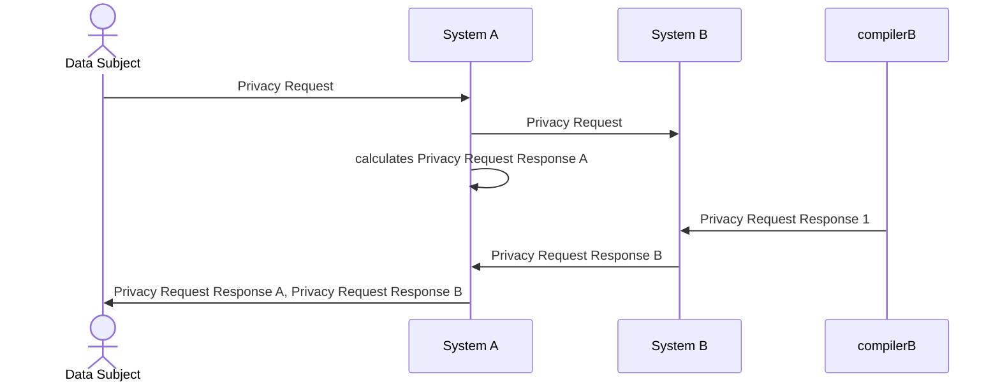
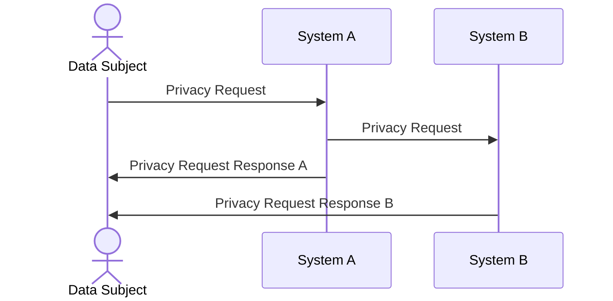

<!-- moved from https://github.com/blindnet-io/product-management/blob/ba5b02d/refs/high-level-architecture/readme.md -->

| Status        | NORMATIVE DRAFT                                                                                                                      |
| :------------ | :----------------------------------------------------------------------------------------------------------------------------------- |
| **PR #**      | [596](https://github.com/blindnet-io/product-management/pull/596), [694](https://github.com/blindnet-io/product-management/pull/694) |
| **Author(s)** | milstan (milstan@blindnet.io)                                                                                                        |
| **Updated**   | 2022-06-14                                                                                                                           |

## Objective

This document is about:

- the context in which [blindnet devkit](./lexicon#blindnet-devkit) has to operate, and
- the structure of components of [blindnet devkit](./lexicon#blindnet-devkit) (in relation to that context).

This document complements the [High Level Conceptualization](./high-level-conceptualization/).
Its goal is to propose the optimal component structure of the product.

## Motivation

The [High Level Conceptualization](./high-level-conceptualization/) is insufficient for understanding of the context of use. We need more clarity about the data capture lifecycle and the parties involved.

Also, having the right structure of components is very important for several reasons, including for:

- client [Systems](./lexicon#system) to be able to use only a part of [blindnet devkit](./lexicon#blindnet-devkit),
- [blindnet devkit](./lexicon#blindnet-devkit) to be interoperable with 3rd party solutions (that cover a sub-scope of our scope or that cover requirements adjacent to our scope),
- [blindnet devkit](./lexicon#blindnet-devkit) to be able to evolve in certain aspects with as little as possible impact on its functioning in other aspects.

## Terminology

- The key words "MUST", "MUST NOT", "REQUIRED", "SHALL", "SHALL NOT", "SHOULD", "SHOULD NOT", "RECOMMENDED", "MAY", and "OPTIONAL" in this document are to be interpreted as described in [RFC 2119](https://datatracker.ietf.org/doc/html/rfc2119)
- The word "CAN" denotes ability of someone or something, and is interpreted as "MUST be able to"
- All terms defined in [RFC-Lexicon-2](./lexicon) are to be interpreted as described there
- Any additional precision about the terms defined in [RFC-Lexicon-2](./lexicon), as well as additional terms such as Consent and Legal Base, provided in [High Level Conceptualization](./high-level-conceptualization/) is to be considered normative

### Overview of the Context

### Key Functions

The system supports secure capture of data and management of Data Subjects' rights throughout the data lifecycle.

As such it needs to support the following functions:

- Data Capture
- Encryption and Access
- Storage
- Transfer
- Data Subject Rights Management

## Proposal - Components

All components are presented in their roles in the following, more detailed image:

### Capture Component

The Capture Component is the entry point of the product. It is responsible for putting in motion [Data Captures](./high-level-conceptualization#the-main-concept---data-capture) in a way that reinforces privacy by ensuring confidentiality and control.

It is responsible for generating Data Capture metadata, including [Consent](./high-level-conceptualization#data-capture--consent). When configured so, it operates alongside [Encryption and Access Management Engine](#encryption-and-access-management-engine) tasked with ensuring confidentiality.

Data MAY be captured from the [Data Subject](./lexicon#data-subject) themself, or from someone else, a [Submitter](./lexicon#submitter).
The roles of Data Subject, [Submitter](./lexicon#submitter), [Data Consumer](./lexicon#data-consumer) and [DPO](./lexicon#dpo) are not exclusive. The same person CAN be in all roles.

### Encryption and Access Management Engine

The Encryption and Access Management is composed of SDKs and APIs allowing to encrypt and decrypt the data in the context of [Data Captures](./high-level-conceptualization#the-main-concept---data-capture).

This component CAN work with external user identity management solutions, as well as external encryption tools.
The component is responsible to allow client [Systems](./lexicon#system) and user-facing components to define and modify the intended [Data Consumers](./lexicon#data-consumer) of a particular Data Capture.
This component also provides functions allowing to support Data Consumers in situations of lost access.

The component MAY accomplish those responsibilities through coordination with user identity management and encryption tools (external or not).

### Privacy Computation Engine

Privacy Computation Engine is a component that client [Systems](./lexicon#system) CAN run in order to interpret their rights to hold and treat a particular [Data Capture](./high-level-conceptualization#the-main-concept---data-capture) at a particular point of time.
The engine CAN also calculate a response to [Data Subjects'](./lexicon#data-subject) [Privacy Requests](./lexicon#privacy-request).

A Privacy Computation Engine component is composed of three elements:

- a [Privacy Compiler](#privacy-compiler)
- a [Customization API](#customization-api)

#### Privacy Compiler

A **_Privacy Compiler_** computes one or more actions (and to them association motivations/reasons/explanations) that need to be performed by a [System](./lexicon#system) in order to respect [Data Subjects'](./lexicon#data-subject) data rights.
Such actions include (not limited to): data deletion, acceptance/denial of [Privacy Requests](./lexicon#privacy-request), and transmission of Privacy Requests to another System.

To compute the appropriate actions, this component CAN register and take into account:

- Data Capture metadata including [Consents](./high-level-conceptualization#data-capture--consent);
- [Settings](./high-level-conceptualization#form-follows-function) of a particular system (e.g. storage location, mandatory duration of data keeping, [Legal Bases](./high-level-conceptualization#data-capture--legal-base) etc.);
- History of transmissions to other Systems;
- Privacy Requests;
- Human input (validation, user ID confirmation, etc.) in response to Privacy Requests.

#### Customization API

The **_Customization API_** allows client [Systems](./lexicon#system) and end-user-facing components to:

- set and modify system-specific [Settings](./high-level-conceptualization#form-follows-function) related to data rights and compliance (e.g. storage location, mandatory duration of data retention, legal bases of processing etc.)
- register and keep track of system-to-system transfers of [Data Captures](./high-level-conceptualization#the-main-concept---data-capture) and noteworthy operations performed on data

> **NB**. The system-specific Settings CAN make the output of two different Privacy Computation Engines to the same Privacy Request fundamentally different.
>
> For example, if System A has transmitted a Data Capture to System B, and Systems and A and B have different Legal Bases for keeping data, when the Data Subject makes a DELETE request, the output of one system's Privacy Computation Engine might be to approve the DELETE request and of the other to deny it.

This engine works in a way inspired by [Digital Rights Management](https://en.wikipedia.org/wiki/Digital_rights_management).

### Privacy Request Manager

Privacy Request Manager is a component allowing different kinds of Users to interact around Privacy Requests. It consists of:

- a [Privacy Request Capture Interface](#privacy-request-capture-interface)
- a [Data Consumer Interface](#data-consumer-interface)

#### Privacy Request Capture Interface

A **_Privacy Request Capture Interface_** is a standardized end-user interface that [Systems](./lexicon#system) CAN (optionally) run to capture [Privacy Requests](./lexicon#privacy-request) from [Data Subjects](./lexicon#data-subject).
A global Privacy Request Capture Interface CAN be hosted on an easy-to-remember URL to capture Privacy Requests in a standardized format ([Schema](#schemas)) on behalf of other Systems.

#### Data Consumer Interface

The Data Consumer Interface component allows [Data Consumers (in different roles, including system administrators and DPOs)](./high-level-conceptualization#submitter--data-consumer--dpo) to interact with the components of the system.
It allows the following functions (that CAN be used separately and SHOULD correspond to separate subcomponents):

- _VIEW_AND_MANAGE_: Data display for the eyes of authorized, authenticated Data Consumers, [acceptance/validation of Data Captures](./high-level-conceptualization#data-capture---states), and data deletion/modification;
- _CONFIGURE_: Input of parameters related to data rights management, necessary for the operation of the Privacy Computation Engine (e.g. storage location, mandatory duration of data keeping, [Legal Bases](./high-level-conceptualization#data-capture--legal-base) etc.);
- _COMPLY_: Input related to processing (acceptance, denial) of [Privacy Requests](./lexicon#privacy-request), review of past Privacy Requests and obtaining proof of past Privacy Requests responses.

### Schemas

For the [System](./lexicon#system) to support interoperability with other Systems and solutions, schemas SHOULD be made (and data export/import implemented using them) for represent the following:

- [Privacy Requests](./lexicon#privacy-request) made by users and allow their transfer from System to System and enforcement of [Data Subjects'](./lexicon#data-subject) rights across Systems holding their data.
- [Data Captures](./high-level-conceptualization#the-main-concept---data-capture) and allow transfer of encrypted captured data across systems while maintaining the integrity of data and its intended usage by intended [Data Consumers](./lexicon#data-consumer)
- Metadata about Data Captures including [Consents](./high-level-conceptualization#data-capture--consent), Data Subjects, etc.)

### Storage Component

The Storage Component allows client [Systems](./lexicon#system) to store the [Data Captures](./high-level-conceptualization#the-main-concept---data-capture).
It CAN interface with Systems that don't have their own storage but integrate the whole confidential data capturing as a fully external workflow, only integrated at the front-end level with their website or app.

The Storage Component CAN be configured to automatically interpret and execute data deletions and modifications according to the output of the [Privacy Computation Engine](#privacy-computation-engine).

## Other Requirements

### Bridge and Interoperability

The components of the system SHOULD be made in a way that favors interoperability — i.e. components CAN easily interoperate with software made in another project for the same purpose.

This principle is already explained in the example of [confidentiality and control interoperability](./high-level-conceptualization#confidentiality--control-bridge).
Appropriate abstractions SHOULD be designed on top of key components for (at least, not limited to) user identity, access management, encryption, Data Rights Management, storage, and Privacy Request capture.
These abstractions SHOULD be inspired by the [Bridge Pattern](https://en.wikipedia.org/wiki/Bridge_pattern).

This interoperability SHOULD support the following (extreme) example scenarios:

- A System that uses Keycloak for user identity management, CAN use our Data Capture component in combination with 3rd party Encryption library. The System CAN instantiate and use our Privacy Computation Engine, and implement their own Storage able to automatically interpret and enforce actions resulting as output of the DPrivacy Computation Engine (automatic deletion and modification).

- A System that is essentially a wordpress website, CAN embed the Capture Component in a wordpress webform, use the Storage Component, the Data Consumer Interface (as separate from the wordpress website), use Privacy Computation Engine and embed the Privacy Request Capture Interface in the wordpress website respecting its look and feel.

- A System that has its own user identity management, uses 3rd party e2ee library, has its own storage and interfaces for data view, CAN instantiate the Privacy Computation Engine and use only the parts of the Data Consumer Interface related to Privacy Request parametrization and approval.

### Separation of Form and Function

The components of [blindnet devkit](./lexicon#blindnet-devkit) MUST be made in such a way that client [Systems](./lexicon#system) CAN use only the functional part and implement its own interfaces or otherwise achieve its own desired look and feel and UX.

### Different Privacy Request Response Scenarios

Thanks to the _Privacy Computation Engine_ the system allows to automatically (or semi-automatically) process Privacy Requests, and do so in a distributed context of several Systems sharing and processing Data Subject's data.

When _Privacy Requests_ are transmitted from one System to another, there are several scenarios for responding to the Data Subject.

The design of [blindnet devkit](./lexicon#blindnet-devkit) MUST at least support the following scenarios:

#### Scenario 1 - Nested Responses

In this scenario, one System receives a Privacy Request from the Data Subject, and transmits it to other Systems. Those Systems calculate their own responses to the Privacy Request, and they send their responses to the System from whom they have received the Privacy Request. This System then replies to the Data Subject.

This scenario is adapted to Privacy Request Requests that do not involve access to the data, especially when not all Systems have the Data Subject's contact information (and MAY want to remain blind for it). For this scenario to work, Systems must expose functions for receiving the responses from other Systems.

#### Scenario 2 - Direct Responses

In this scenario, one System receives a Privacy Request from the Data Subject, and transmits it to other Systems. Those Systems calculate their own responses to the Privacy Request, and they send their responses directly to the Data Subject.

This scenario is adapted to Privacy Requests where revealing of the response to other Systems (instead of sending it directly to the Data Subject) might further compromise the Data Subject's privacy OR when the system having collected the Privacy Request from the Data Subject is a server-less system (unable to receive responses from other systems). For this scenario to work, it might be necessary, if not already the case, to share Data Subject's contact data among the corresponding Systems.

## Related Documents

### Normative References

- [High Level Conceptualization](./high-level-conceptualization/)
- [RFC-Lexicon-2](./lexicon)

### Informative References

- [Digital Rights Management](https://en.wikipedia.org/wiki/Digital_rights_management)
- [Bridge Pattern](https://en.wikipedia.org/wiki/Bridge_pattern)
