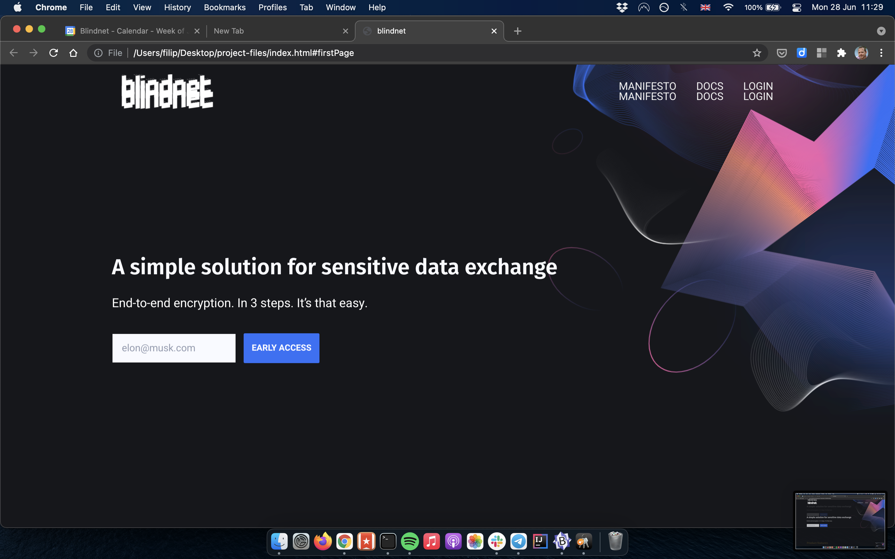

# Welcome to MkDocs

For full documentation visit [mkdocs.org](https://www.mkdocs.org).

[yo](about.md#lol)  
[yo yo](test/test1.md)

## admonitions

The `#!python range()` function is used to generate a sequence of numbers.

=== "javascript"
    
    `yarn add blindnet`

    ``` javascript
    import { Blindnet } from 'blindnet'
    ```

=== "C++"

    ``` c++
    #include <iostream>

    int main(void) {
      std::cout << "Hello world!" << std::endl;
      return 0;
    }
    ```

!!! failure ""
    no title

???+ note "custom title"
    this is some code

    ```javascript hl_lines="2 3"
    const x = 10
    function asd(xx: string): Promise<void> {
        return x + xx
    }
    ```
    text

## yo



## Commands

* `mkdocs new [dir-name]` - Create a new project.
* `mkdocs serve` - Start the live-reloading docs server.
* `mkdocs build` - Build the documentation site.
* `mkdocs -h` - Print help message and exit.

## Asd

```javascript
const x = 10
function asd(xx: string): Promise<void> {
    return x + xx
}
```

## Project layout

    mkdocs.yml    # The configuration file.
    docs/
        index.md  # The documentation homepage.
        ...       # Other markdown pages, images and other files.
